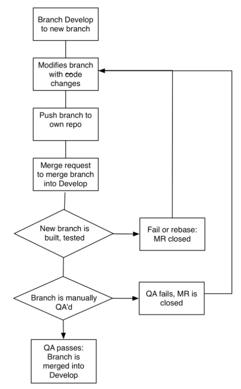

# Code Submission Process

Table of Contents
=================

* [Prerequisites](#prerequisites)
* [Initial Git Setup](#initial-git-setup)
* [Git Workflow](#git-workflow)
* [Code submission: Feature branches](#code-submission-feature-branches)
  * [Code submission: flow chart](#code-submission-flow-chart)
  * [End of sprint: Create release version](#end-of-sprint-create-release-version)
	* [Hotfixes](#hotfixes)
* [Updating the Stage server](#updating-the-stage-server)
* [Updating the Production Server](#updating-the-production-server)

**IMPORTANT:**
- Copy this into your `PROJECT/docs/` and replace all occurances of `CLIENT` and `PROJECT` as needed for your implementation.
- Slack integration, scripts like prod-update, and maintenance windows may vary per client, also.

## Prerequisites
- Working sandbox with Git installed and current code base
- Engineer Git account on git.civicactions.net

## Initial Git Setup
The following steps only need to be run once to setup your git environment.

1. **Clone the repository** (we generally call name this `~/workspace/PROJECT` for co-working consistency, but you can name it as you like):
```
cd ~/workspace
git clone git@git.civicactions.net:CLIENT/PROJECT.git PROJECT
```
2. **Fork the repository:**
- Go to https://git.civicactions.net/CLIENT/PROJECT and click the 'Fork' button.
3. **Setup your own remotes** so that you can specify a remote by name. Do this on your current local copy of the PROJECT repo:
```
cd ~/workspace/PROJECT
git remote rename origin prime
# Replace GITLAB_USERNAME to match your gitlab username in this next command
git remote add myfork git@git.civicactions.net:GITLAB_USERNAME/PROJECT.git
```
4. **Disable pushing to prime:**
```
git remote set-url --push prime no-pushing
```
5. ***Verify your remotes.*** `prime` and `myfork` should be listed as remotes.
```
git remote -v
```

## Git Workflow
Here is a summary of the approach:

The *prime/develop* branch is the main code base. This branch is used to update the Dev server each time the branch is updated. The Dev server is subject to periodic automated testing to ensure that changes pushed to Dev do not cause our standard tests to fail.

When we have a coding task, we create a new local branch of *prime/develop* and give it the name of the ticket we are working on. We then push that branch to our own repo (*myfork*) located on git.civications.net. From that branch (on git.civications.net), we submit a request to merge the branch with *develop* using the gitlab interface. Once that branch passes all the tests, code review, and QA, it is merged into *develop*. And the Dev server is updated (using a command from the RROJECT-int Slack channel).

When we are ready to push *prime/develop* to Stage (for testing) and Prod (the live server), we create a new branch from *develop* and name it the next version iteration, (e.g. **v2.18.0**). Hotfixes (fixes introduced out of cycle, during a sprint) are indicated by being given a subversion number, (e.g. **v2.18.1**).

This enables us to test the exact same code on Stage that we will push to Prod. And it’s the exact code that passed tests on Dev prior to being branched for live testing on Stage. 

The next sections provide detail on:
- how code is checked out from *develop*,
- a new feature branch created in *myfork*,
- that feature branch is tested and then merged back into *develop*,
- how a “snapshot” is made of *develop* and installed on Stage for live testing,
* and then finally that “snapshot” is installed on the Production server.

## Code submission: Feature branches
**Feature branches** are what a developer interacts with on a day to day basis. Here is an example of what this might look like:

If a developer wants to do work on a ticket RD-1234 which requires a new chicken dance feature, the git process this developer will go through might look something like this:

1. **Open ticket.** At the beginning of a ticket, Engineer opens ticket RD-1234 and assigns it to themself
2. **Update develop branch.** The engineer updates their local *develop* branch with the latest code from *prime/develop*. 
```
git checkout develop
git pull --rebase prime develop
```
3. **Create new feature branch.** Engineer creates a new feature branch to work in using the ticket ID as the branch name.
```
git checkout -b RD-1234-chicken-dance
```
4. **Commit work.** At this point the developer will do his/her work and create multiple commits in their feature branch. 
  1. Commits are made as small as possible
  2. Each commit message contains the ticket ID and describes the work being done
5. **Rebase from prime/develop.** Once the work is done, they will push their work to their fork repository. Before pushing a branch to a remote repo, it’s a good idea to rebase the feature branch before pushing to the remote repository.
```
git pull --rebase prime develop
```
6. **Push to your remote repository.**
```
git push myfork rd-1234-chicken-dance
```
7. **Create Merge Request (MR).** After the branch has been pushed to *myfork* a merge request should be created against *prime/develop*. This is accomplished by submitting a GitLab merge request from your own repo, to merge your new branch into *prime/develop*
  1. Note the merge request in the original ticket and provide a link to the ticket in the merge request description. Set the ticket status to Code Review and remove your name from the ticket.
8. **Jenkins / Behat testing.** New branch is built and tested against the current devtest database by the Jenkins server at https://ci.civicactions.net
  1. If branch fails test or rebase is needed, MR is closed, and ticket returned to Engineer. Ticket status is move back to To Do, and comments are added to the let the engineer know what happened.
  2. If branch passes test, ticket status is set to “QA” and another staff member will QA the ticket.
9. **Manual QA.** Branch is QA’d on separate build by another staff member.
  1. If QA of build fails, MR is closed, and ticket returned to Engineer. Ticket status is changed back to ToDo and comments added to explain how the feature failed QA.
  2. If QA of build passes. Comments are added detailing the specific steps that passed QA. The ticket is set to “Ready to Merge.” 
10. Branch is merged into *develop*, ticket is marked "Ready for PO Review" and assigned to the Product Owner

### Code submission: flow chart



### End of sprint: Create release version
1. At end of Sprint, the *develop* branch is branched into a version branch, and the sub-version is incremented by one. For example, **v2.16.0** is incremented to **v2.17.0**

#### Hotfixes
  1. If a hotfix is required, the version sub-version decimal version is incremented by one, For example, v.2.16.0 is incremented to v.2.16.1
  2. Hotfixes go through the same updating process as scheduled code pushes, the only difference is that the Stage database is **NOT** updated (skipping steps 1.1 and 1.2 below

## Updating the Stage server
1. The Staging server is then updated on the **Thursday of the end of the Sprint at 5 pm Eastern time**, with a current version of the Production database, and the code is updated to the new version branch.
  1. The current db is dumped:
```
drush sql-dump
```
  2. The daily backup at `~/latest` is unpacked and uploaded to Stage:
```
drush sql-cli < ~/latest/[dbname]
```
  3. The code base is updated:
```
site-update PROJECT.stage [version name] nobackup
```
  4. The feature list is reviewed and any features that aren’t reverted, need to be reverted.
    * To display the feature list:
```
drush fl
```
    * To revert a feature:
```
drush fr [feature name] ([feature name]) –y
```
  5. The rules list should be reviewed in the UI to ensure that all rules have been reverted. If not, you can manually revert all rules using drush:
```
drush rules-revert-all
```
  6. Any manual configuration that needs to happen must be noted in a separate Implementation ticket, assigned to the person doing the Stage update, with a deadline of 5pm Eastern on the day of the update.
  The implementation ticket is then revised with a new deadline so that manual configuration can be done with the push to the Production server on the following Monday.
2. The Staging site is reviewed to ensure that basic functions are restored.
3. The Staging server is then reviewed by TL and Product Owner. Product Owner should review sprint product on Staging server and alert staff/open bug tickets if any problems are found.

## Updating the Production Server
On the Monday, at 5pm Eastern time after updating Stage, the Production server is updated with the new version of the code.
1. **~/bin/prod-update** is modified to include the most recent version branch:
```
vim ~/bin/prod-update
```
then modify line 6 to reflect current version branch name.
2. The site is put into “Maintenance Mode” via the UI, and the cache is cleared.
3. The prod-update script is run:
```
cd ~/prod 
prod-update
```
4. At this point the update process should notify Slack, and the Production server should be updated.
5. The feature list should be reviewed to make sure that all features have been reverted, and the rules list should be reviewed to ensure that all rules have been reverted.
6. Any manual configurations requested in Implementation tickets should be done after the code is updated, and all reversions verified.
7. The site should be taken out of “Maintenance Mode”
8. The TL and Product Owner should review the Production server to ensure that the site is functional.
